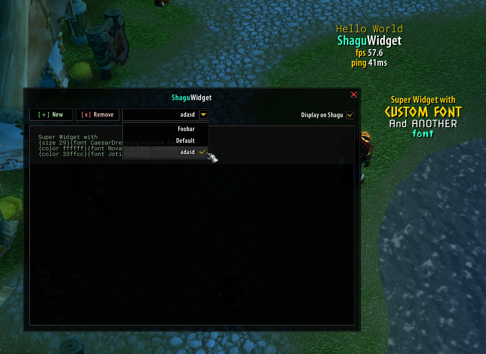

# ShaguWidget

ShaguWidget is an addon for the original World of Warcraft: Vanilla (1.12.1) and The Burning Crusade (2.4.3) gameclients. It is highly configurable and is able to monitor several game variables including the memory, upload, download, server time, unit names, levels, health, mana, money and much more. ShaguWidget is drawn directly to the World Frame, allowing it to stays visible even when the UI is fade out.

The addon supports adding multiple widgets. Each widget can be scripted and customized via the built-in widget editor using plain text and several variables. Every widget can be toggled for each character. In order to move a widget, the editor has to be opened.

## Commands

To start the editor/unlock mode:

* /shaguwidget
* /swidget
* /widget

## Preview

YouTube Video on the initial prototype: [HERE](https://www.youtube.com/watch?v=6xT7l5_q-fY)

## Variables
* **{color COLOR}** - Set the color to following characters to the given hex color (RRGGBB) such as: "33ffcc". If empty, the color will be reset to game defaults.

* **{size SIZE}** - Set the font size of the entire line to a specific size. Defaults to 12.

* **{font FONT}** - Set the font family of the entire line to a specific font. Defaults to default game font. For details, see the font section below.

* **{date FORMAT}** - Displays the given date format. Defaults to "%M/%D/%Y %H:%M:%S". For details, see: [Lua docs](https://www.lua.org/pil/22.1.html)

* **{name UNIT}** - Displays the name of the given unit. Defaults to own character name. For details, see [WoWWiki](https://wowwiki.fandom.com/wiki/UnitId))

* **{level UNIT}** - Displays the level of the given unit. Defaults to own character level. For details, see [WoWWiki](https://wowwiki.fandom.com/wiki/UnitId))

* **{health UNIT}** - Displays the health of the given unit. Defaults to own character health. For details, see [WoWWiki](https://wowwiki.fandom.com/wiki/UnitId))

* **{maxhealth UNIT}** - Displays the maximum health of the given unit. Defaults to own character max health. For details, see [WoWWiki](https://wowwiki.fandom.com/wiki/UnitId))

* **{mana UNIT}** - Displays the mana of the given unit. Defaults to own character mana. For details, see [WoWWiki](https://wowwiki.fandom.com/wiki/UnitId))

* **{maxmana UNIT}** - Displays the maximum mana of the given unit. Defaults to own character max mana. For details, see [WoWWiki](https://wowwiki.fandom.com/wiki/UnitId))

* **{gold}** - Displays the characters gold.

* **{silver}** - Displays the characters silver.

* **{copper}** - Displays the characters copper.

* **{realm}** - Display the realm name.

* **{fps}** - Displays the FPS.

* **{ping}** - Displays the ping in milliseconds.

* **{up}** - Displays the current upload in KB/s.

* **{down}** - Displays the current download in KB/s.

* **{mem}** - Displays the RAM usage of all addons in MB.

* **{memkb}** - Displays the RAM usage of all addons in KB.

* **{serverh}** - Displays the servertime clock (hour).

* **{serverm}** - Displays the servertime clock (minutes).

* **{itemcount NAME}** - Displays how many of the given items are carried in the inventory.

## Fonts
### Builtin Fonts
ShaguWidget already includes 14 fonts taken from the [google font project](https://fonts.google.com/):

  * `{font BalooBhaina}` *(website: [BalooBhaina](https://fonts.google.com/specimen/Baloo+Bhaina))*
  * `{font Bungee}` *(website: [Bungee](https://fonts.google.com/specimen/Bungee))*
  * `{font CaesarDressing}` *(website: [CaesarDressing](https://fonts.google.com/specimen/Caesar+Dressing))*
  * `{font CoveredByYourGrace}` *(website: [CoveredByYourGrace](https://fonts.google.com/specimen/Covered+By+Your+Grace))*
  * `{font JotiOne}` *(website: [JotiOne](https://fonts.google.com/specimen/Joti+One))*
  * `{font LodrinaSolid}` *(website: [LodrinaSolid](https://fonts.google.com/specimen/Londrina+Solid))*
  * `{font NovaFlat}` *(website: [NovaFlat](https://fonts.google.com/specimen/Nova+Flat))*
  * `{font Roboto}` *(website: [Roboto](https://fonts.google.com/specimen/Roboto))*
  * `{font RobotoMono}` *(website: [RobotoMono](https://fonts.google.com/specimen/Roboto))*
  * `{font SedgwickAveDisplay}` *(website: [SedgwickAveDisplay](https://fonts.google.com/specimen/Sedgwick+Ave+Display))*
  * `{font Share}` *(website: [Share](https://fonts.google.com/specimen/Share))*
  * `{font ShareBold}` *(website: [ShareBold](https://fonts.google.com/specimen/Share))*
  * `{font Sniglet}` *(website: [Sniglet](https://fonts.google.com/specimen/Sniglet))*
  * `{font SquadaOne}` *(website: [SquadaOne](https://fonts.google.com/specimen/Squada+One))*

### Custom Fonts
In order to use a custom font, make sure it's a TrueType (`.ttf`) font and copy it to the `Interface\AddOns\ShaguWidget[-tbc]\fonts` directory. It might be required to restart the game, before you can access it via the regular `{font YOURFONT}` variable.
